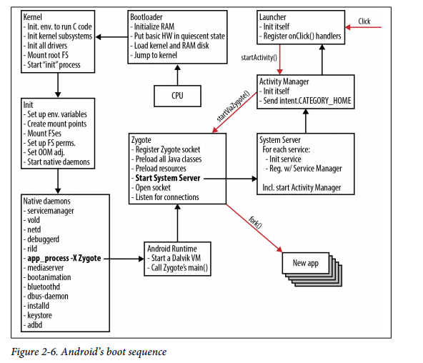

# Android系统启动

## NFS启动Android

设置bootargs和bootcmd参数：

``` shell
set bootcmd tftpboot c0008000 192.168.1.14:kernel.img\; bootm c0008000

set bootargs root=/dev/nfs rwnfsroot=192.168.1.14:/nfsboot/root ip=192.168.1.20:192.168.1.14:192.168.1.1  console=ttySAC2,115200
```

## 系统启动流程

### 启动过程



Android系统完整的启动过程，可分为Linux系统层、Android系统服务层、Zygote进程模型三个阶段，从开机到启动Home Launcher完成具体的任务细节可分为七个步骤。

1. 启动BootLoader
2. 加载系统内核
3. 启动Init和其它重要守护进程
4. 启动Zygote进程
5. 启动Runtime进程，初始化Service Manager。Service Manager用于binder通讯，负责绑定服务的注册与查找。
6. 启动SystemService
7. 启动Home Laucher
8. 启动其它应用程序


## 相关服务

了解各个服务的作用的使用方法

系统: `Android系统: 5.1`

### servicemanager

管理系统的各种服务,而其自身同样是一种服务.

```
service servicemanager /system/bin/servicemanager                               
    class core
    user system
    group system
    critical
    onrestart restart healthd
    onrestart restart zygote
    onrestart restart media
    onrestart restart surfaceflinger
    onrestart restart drm
```
ServiceManager进程的启动，远比`zygote`要早，因为在启动zygote进程时需要用到ServiceManager进程的服务。ServiceManager是一个`守护进程`，它维护着系统服务和客户端的binder通信。

>dir: frameworks/native/cmds/servicemanager

### vold

Vold 也即`volume Daemon`， 是Android存储类的守护进程，管理SD，USB等存储类的热拔插事件

```
service vold /system/bin/vold
    class core
    socket vold stream 0660 root mount           
    ioprio be 2
```
>Dir: system/vold/

### netd

Netd是Android的网络守护进程。NetD是个网络管家,封装了复杂的底层各种类型的网络(NAT,PLAN,PPP,SOFTAP,TECHER,ETHO,MDNS等)，隔离了底层网络接口的差异，给Framework提供了统一调用接口，简化了网络的使用。

NetD主要功能是:
* 第一、接收Framework的网络请求，处理请求，向Framework层反馈处理结果;
* 第二、监听网络事件(断开/连接/错误等),向Framework层上报。

```
service netd /system/bin/netd                                
    class main
    socket netd stream 0660 root system
    socket dnsproxyd stream 0660 root inet
    socket mdns stream 0660 root system
    socket fwmarkd stream 0660 root inet
```
>Dir: system/netd/

### debuggerd

### rild

`RIL(Radio Interface Layer)`

Rild是Init进程启动的一个本地服务，这个本地服务并没有使用Binder之类的通讯手段，而是采用了socket通讯这种方式

Android给出了一个ril实现框架。由于Android开发者使用的Modem是不一样的，各种指令格式，初始化序列都可能不一样，GSM和CDMA就差别更大了，所以为了消除这些差别，Android设计者将ril做了一个抽象，使用一个虚拟电话的概念。这个虚拟电话对象就是GSMPhone（CDMAPhone),Phon对象所提供的功能协议，以及要求下层的支撑环境都有一个统一的描述，这个底层描述的实现就是靠RIL来完成适配

```
service ril-daemon /system/bin/rild                                           
    class main
    socket rild stream 660 root radio
    socket rild-debug stream 660 radio system
    user root
    group radio cache inet misc audio log
```

### app_process

### mediaserver

```
service media /system/bin/mediaserver
    class main
    user media
    group audio camera inet net_bt net_bt_admin net_bw_acct drmrpc mediadrm
    ioprio rt 4
```

### bootanimation

```
service bootanim /system/bin/bootanimation
    class core
    user graphics
    group graphics audio
    disabled
    oneshot
```

### bluetoothd

### dbus-daemon

### installd

```
service installd /system/bin/installd
    class main
    socket installd stream 600 system system
```

### keystore


```
service keystore /system/bin/keystore /data/misc/keystore                                   
    class main
    user keystore
    group keystore drmrpc
```

### adbd

## 参考

1. [android启动之ServiceManager启动](http://www.tuicool.com/articles/3Evuei3)
2. [Android Vold架构 ](http://blog.chinaunix.net/uid-22935566-id-3039918.html)
3. [电话系统之rilD](http://blog.csdn.net/maxleng/article/details/5576637)
