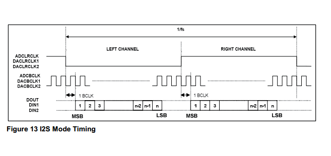
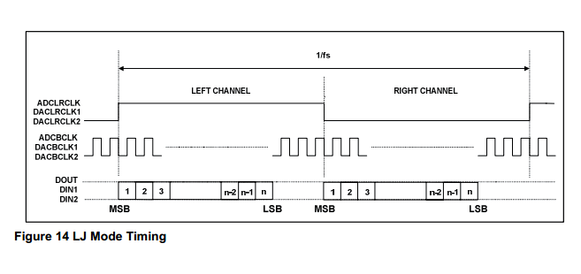
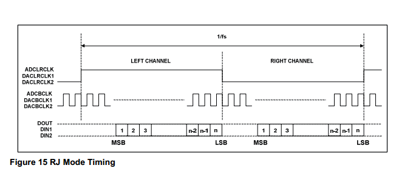
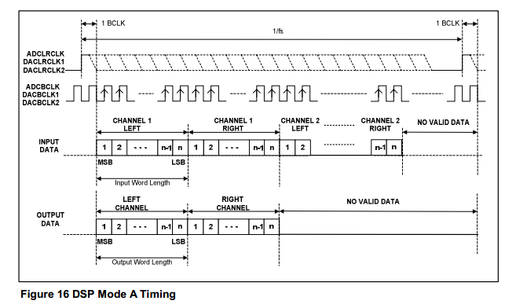
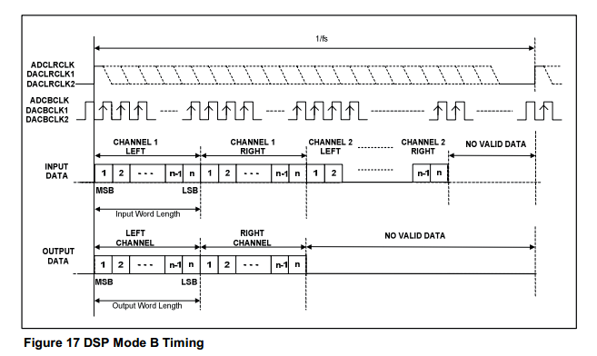

# 音频数字接口

## I2S

### I2S

### LJ (Left Justified)

### RJ (Left Justified)

## PCM

### DSP mode A

### DSP mode B

## TDM

## 参考

1.[TDM格式介绍 - 音频数据传输的常见IC间数字接口介绍](http://www.elecfans.com/video/yinpinjishu/20121210301406_2.html)
